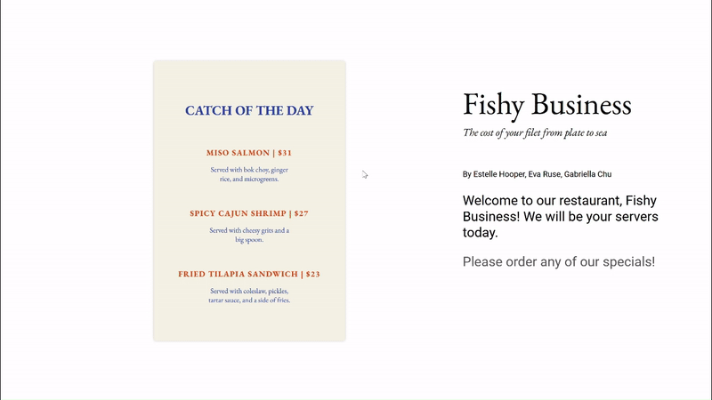

# [Fishy Business: The Cost of Your Filet from Plate to Sea](https://gitstelle.github.io/info4310-fishy-business/)

This was a group project authored by Estelle Hooper, Eva Ruse, and Gaby Chu for INFO 4310: Interactive Information Visualization in spring 2023. We were prompted to "develop an interactive news article, guide, or editorial that incorporates visualizations and data... to inform readers about a current issue, provide a data-driven guide on a topic of interest, or make an argument."

## Table of Contents

- [Fishy Business: The Cost of Your Filet from Plate to Sea](#fishy-business-the-cost-of-your-filet-from-plate-to-sea)
  - [Table of Contents](#table-of-contents)
  - [Overview](#overview)
    - [Techniques](#techniques)
    - [Motivation](#motivation)
    - [Intended Audience](#intended-audience)
    - [Data](#data)
  - [Acknowledgements/References](#acknowledgementsreferences)
  - [License](#license)

## Overview

You can access our project [here!](https://gitstelle.github.io/info4310-fishy-business/)

### Techniques
HTML, CSS, JavaScript (d3.js), interactive scrolling

### Motivation
We aim to visualize and contextualize the environmental cost and sourcing of fish for the consumer. With all foods, most consumers only see a nicely cooked fish at a restaurant or a cleaned filet in plastic packaging at the grocery store. Our project is a general guide to the sourcing and consequences of three popular seafoods. After browsing our website, our hope is to incite curiosity of where our purchases come from and our participation in sustainability. 

### Intended Audience
Our intended audience is the average consumer. A data article like this would not be in a scientific journal but a general news source. This article is intended to be an interesting and
interactive way to provide an overview of the environmental costs of the fish we consume.

### Data
The data we used was generally simple and didn’t require much cleaning. We had to modify some country names in the dataset to match our JSON file and only used 13 observations from each of the CSV files we used for the 13 unique line charts we made using the Kaggle dataset. Some observations in the CSV files needed to be reordered so that they would animate properly on the line graph animation.

Original data sources:
- [Fish and Overfishing](https://www.kaggle.com/datasets/sergegeukjian/fish-and-overfishing) by Kaggle User (likely collected from somewhere else but could not verify)
  - specifically `aquaculture-farmed-fish-production.csv` and `capture-fishery-production.csv`

- *Our World in Data* tables
  - [Freshwater use per kilogram of seafood production (farmed)](https://ourworldindata.org/grapher/freshwater-use-seafood?tab=table&country=~Salmon+%28farmed%29)
  - [Land use per kilogram of seafood (farmed)](https://ourworldindata.org/grapher/land-use-seafood?tab=table&country=~Salmon+%28farmeTd%29)
  - [Nitrogen emissions per tonne of seafood (farmed)](https://ourworldindata.org/grapher/nitrogen-emissions-seafood?tab=table&country=~Salmon+%28farmed%29)
    - [Aqua-Calc](https://www.aqua-calc.com/) to convert to fl. oz.
  - Phosphorous emissions per tonne of seafood (farmed)
    - [Aqua-Calc](https://www.aqua-calc.com/) to convert to fl. oz.
- [Top Exporters of Salmon](https://www.statista.com/statistics/1294352/leading-worldwide-salmon-exporters-by-export-share/) 
- [Top Exporters of Shrimp](https://www.businesswire.com/news/home/20210430005311/en/Global-Shrimp-Market-Report-2021-2026-Production-Export-Import-Consumption-Countries-Species-Product-Form-Size-Value-Chain-Analysis-Forecasts---ResearchAndMarkets.com)
- [Top Exporters of Tilapia](https://www.researchandmarkets.com/reports/5317038/global-tilapia-market-forecast-by-production?utm_source=GNOM&utm_medium=PressRelease&utm_code=sbtklg&utm_campaign=1537348+-+Global+Tilapia+Market+Report+2021-202+with+Company+Analysis+of+Seatrade%2c+Atlantic+Capes+Fisheries%2c+Inc%2c+Atalanta+Corporation%2c+Ideal+Foods+Ltd%2c+Sea+Delights&utm_exec=chdo54prd)
- [World Map TopoJson](https://github.com/topojson/world-atlas)

## Acknowledgements/References

Thank you to [Cuthbert Chow's tutorial on implementing a scroller.](https://towardsdatascience.com/how-i-created-an-interactive-scrolling-visualisation-with-d3-js-and-how-you-can-too-e116372e2c73) We used his `scroller.js` in our article.

Thank you to Hannah Ritchie and Max Roser. We were very inspired by their *Our World in Data* article ["Fishing and Overfishing (2021)."](https://ourworldindata.org/fish-and-overfishing)

Thank you to Professor Rzeszotarski and the INFO 4310 course staff!

## License
[MIT License](https://opensource.org/license/mit/)